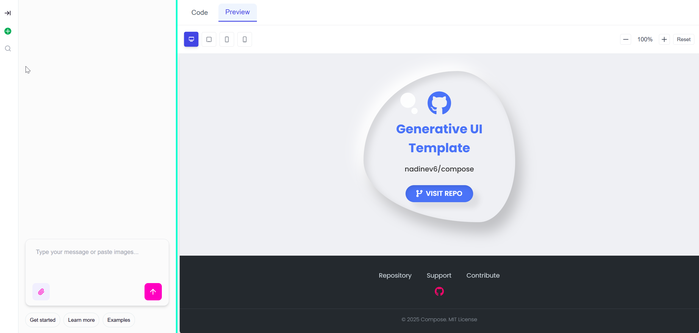

# 🚀 Compose with Tambo

<div align="center">


[](https://opensource.org/licenses/MIT)
[](http://makeapullrequest.com)
[](https://github.com/nadinev6/compose)

**AI-powered email composition platform for drafting, proofreading, styling, and sending professional emails**

[🎯 Live Demo](#) • [📖 Documentation](#getting-started) • [🐛 Report Bug](https://github.com/nadinev6/compose/issues) • [✨ Request Feature](https://github.com/nadinev6/compose/issues)

</div>

---

## 📸 Preview



*Generate professional email templates with AI and preview them across different devices in real-time*

## ✨ Features

### ✍️ **AI-Powered Email Composition**
- **Draft Generation** - Create emails from natural language prompts
- **Proofreading & Editing** - AI-powered grammar and style corrections
- **Content Enhancement** - Improve tone, clarity, and engagement
- **Smart Suggestions** - Context-aware writing assistance

### 🎨 **Professional Email Design**
- **Live Code Editor** - Syntax-highlighted HTML/CSS editor with Monaco Editor
- **Real-time Preview** - See changes instantly as you type
- **Template Library** - Pre-built professional email templates
- **Custom Styling** - Full control over design and branding

### 📱 **Responsive Layout Testing**
- **Desktop View** - Full-width email preview (up to 1200px)
- **Tablet Mockup** - 600x800px with realistic device frame
- **Mobile Mockup** - 320x568px iPhone-style preview
- **Cross-Device Compatibility** - Ensure perfect rendering across all devices

### 📧 **Email Client Compatibility**
- **Multi-Client Testing** - Preview how emails render in different email clients
- **Outlook Compatibility** - Optimized for Microsoft Outlook rendering
- **Gmail Support** - Tested for Gmail web and mobile clients
- **Apple Mail** - Compatible with iOS and macOS Mail apps

### 🚀 **Direct Email Sending**
- **Mailgun Integration** - Send emails directly from the application
- **Delivery Tracking** - Monitor email delivery status and analytics
- **Bounce Management** - Handle bounced emails and delivery failures
- **Send Scheduling** - Schedule emails for optimal delivery times

### 🛠️ **Developer Experience**
- **TypeScript** - Full type safety throughout the application
- **Component Architecture** - Modular, reusable React components
- **Hot Reload** - Instant development feedback
- **Modern Stack** - Built with Next.js 15 and React 19

## 🚀 Getting Started

### 🎯 Use as Template

This repository serves as a template for building AI-powered email composition applications. You can:

- **Fork this repository** to create your own version
- **Use as template** by clicking "Use this template" on GitHub
- **Contribute improvements** back to the main repository
- **Build custom features** on top of the existing foundation

### Prerequisites

- Node.js 18+ 
- npm or yarn
- Tambo AI API key
- Mailgun account (for email sending)

### Installation

1. **Clone the repository**
   ```bash
   git clone https://github.com/nadinev6/compose.git
   cd compose
   ```

2. **Install dependencies**
   ```bash
   npm install
   # or
   yarn install
   ```

3. **Set up environment variables**
   ```bash
   cp .env.example .env.local
   ```
   
   Add your API keys:
   ```env
   # Tambo AI Configuration
   NEXT_PUBLIC_TAMBO_API_KEY=your_tambo_api_key_here
   
   # Mailgun Configuration
   MAILGUN_API_KEY=your_mailgun_api_key
   MAILGUN_DOMAIN=your_mailgun_domain
   MAILGUN_FROM_EMAIL=noreply@yourdomain.com
   ```

4. **Start the development server**
   ```bash
   npm run dev
   # or
   yarn dev
   ```

5. **Open your browser**
   Navigate to [http://localhost:3000](http://localhost:3000)

## 🎯 How to Use

### 1. **Compose with AI**
Simply describe what you need in natural language:
- "Draft a professional follow-up email for a client meeting"
- "Create a promotional email for our Black Friday sale"
- "Write a welcome email for new newsletter subscribers"
- "Proofread this email and improve the tone"

### 2. **Design & Style**
- Switch to the **Code** tab to edit HTML/CSS directly
- Use the Monaco editor with syntax highlighting
- Apply professional styling and branding
- Make real-time changes and see instant updates

### 3. **Test Responsiveness**
- Click **Desktop**, **Tablet**, or **Mobile** to test layouts
- Ensure perfect rendering across all devices
- Verify email client compatibility

### 4. **Send Directly**
- Use the integrated Mailgun service to send emails
- Track delivery status and engagement metrics
- Schedule emails for optimal delivery times

## 🏗️ Architecture

### Tech Stack
- **Frontend**: Next.js 15.4.1 + React 19.1.0
- **Language**: TypeScript 5.0
- **AI Integration**: Tambo AI SDK
- **Styling**: Tailwind CSS v4
- **Code Editor**: Monaco Editor
- **Validation**: Zod schemas

### Key Components
- **InteractableEditor** - AI-controllable code editor with `withInteractable` wrapper
- **Device Preview System** - Responsive preview with device mockups
- **Tambo Integration** - Component and tool registration for AI control
- **Real-time Sync** - Bidirectional content synchronization

## 🔧 Configuration

### Tambo AI Setup
The application uses Tambo AI's `withInteractable` system to allow AI control of components:

```typescript
// Component registration
export const components = [
  {
    name: 'CodeEditor',
    description: 'A code editor for HTML/CSS email templates',
    component: InteractableEditor,
    propsSchema: editorSchema,
  }
];
```

### Environment Variables
```env
# Required
NEXT_PUBLIC_TAMBO_API_KEY=your_tambo_api_key

# Optional
NEXT_PUBLIC_APP_URL=http://localhost:3000
```

## 🤝 Contributing

We welcome contributions! Here's how you can help:

1. **Fork the repository**
2. **Create a feature branch** (`git checkout -b feature/amazing-feature`)
3. **Commit your changes** (`git commit -m 'Add amazing feature'`)
4. **Push to the branch** (`git push origin feature/amazing-feature`)
5. **Open a Pull Request**

### Development Guidelines
- Follow TypeScript best practices
- Use conventional commit messages
- Add tests for new features
- Update documentation as needed

## 📋 Roadmap

### 🚧 Current Status: **In Development**


### 🎯 Planned Features
- [ ] A/B testing and optimization tools
- [ ] Team collaboration and sharing features
- [ ] Advanced email analytics and insights
- [ ] Custom component library
- [ ] Email deliverability scoring
- [ ] Integration with popular CRM systems
- [ ] Automated email sequences and workflows

## 📄 License

This project is licensed under the MIT License - see the [LICENSE](LICENSE) file for details.

## 🙏 Acknowledgments

- **Tambo AI** - For the amazing AI integration capabilities
- **Vercel** - For Next.js and deployment platform
- **Monaco Editor** - For the excellent code editing experience
- **Tailwind CSS** - For the utility-first CSS framework

## 📞 Support

- 📧 **Email**: support@yourdomain.com
- 💬 **Discord**: [Join our community](#)
- 🐛 **Issues**: [GitHub Issues](https://github.com/yourusername/ai-email-builder/issues)
- 📖 **Docs**: [Documentation](#)

---

<div align="center">

**Made with ❤️ by [Nadine](https://github.com/nadinev6)**

⭐ **Star this repo if you find it helpful!** ⭐

</div>

---

## 📈 Star History

<div align="center">

[](https://star-history.com/#nadinev6/compose&Date)

</div>